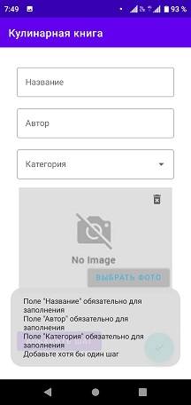
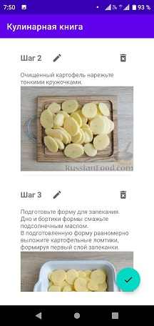
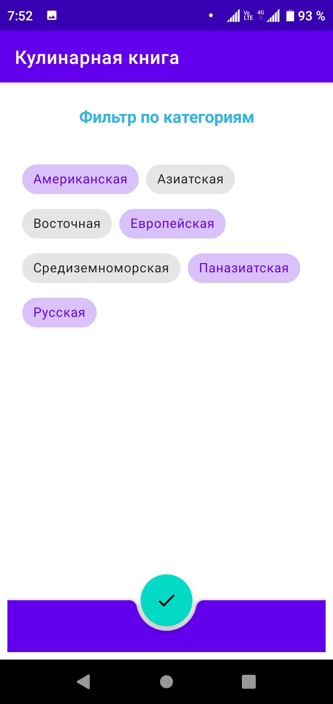
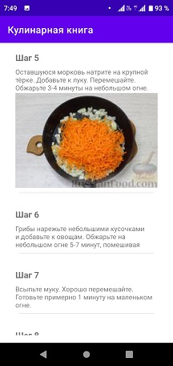

# Кулинарная книга (CookBook)
Разработка приложения в рамках дипломного проекта курса «Android-разработчик» образовательной онлайн-платформы Нетология.

Приложение позволяет создавать, просматривать и редактировать собственные рецепты.

## Особенности приложения:
* Запрос разрешений доступа к памяти устройства для возможности загрузки изображений:

    
* Создание рецепта с возможностью выбора изображения готового блюда:

     
* Добавление этапов приготовления (шагов) с возможностью загрузки изображений отдельно на каждом шаге:

  
* Редактирование / удаление этапов приготовления:

  
* Просмотр списка всех рецептов с возможностью фильтрации по категориям, поиск по названию рецепта:

        
* Добавление / удаление рецептов в Избранное:

  
* Режим просмотра рецепта:

      
* Редактирование / удаление рецептов:

  
* Картинка-заглушка для пустого экрана в случае отсутствия рецептов:

  
* Реализация drag & drop

## Особенности реализации:
* Адаптеры RecipesAdapter и StepsAdapter для вывода в RecyclerView соответственно списка рецептов и шагов (пакет *adapter*)

* Хранение рецептов и шагов приготовления в разных таблицах БД

* Для более удобной работы с фильтрами создан класс *EnabledCategories* (пакет *data*), который хранит текущее состояние фильтра по каждой категории. Между перезапусками приложения отмеченные фильтры хранятся в shared preferences

* Вспомогательный класс для редактирования рецептов (*data/RecipeEditor*)

* Отдельный класс для запроса разрешений доступа к памяти устройства (*util/OrderPermission*)

* Отдельный класс для запуска Intent выбора изображений (*util/OpenImageIntent*)

* Функция расширения *loadBitmapFromPath* для загрузки масштабированного изображения в ImageView (*util/loadScaledBitmap.kt*)

Дополнительно подключаемые библиотеки: *livedata*, *fragment*, *room*.
